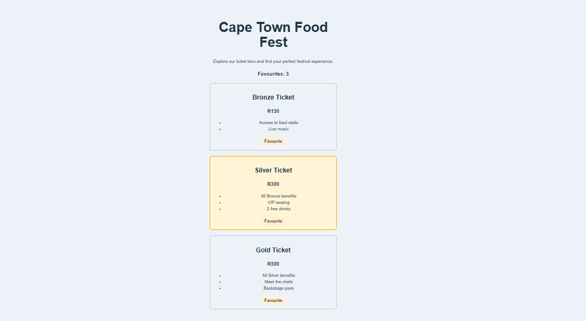

This is a Vue.js single-page application built for Module 1 – Frontend Web Development (Exercise 02).
It displays different Food Festival ticket tiers, highlights a featured option, and allows users to bookmark tickets.

The project is built using Vue 3 + Vite, following a simple Options API structure suitable for beginner student projects.

 Project Overview

The page showcases:

A clean landing section for the Cape Town Food Fest

Ticket tiers displayed as cards

A featured ticket highlighted visually

A bookmark button that increases a counter

A simple, responsive layout

This project focuses on component-based design using props, events, and dynamic rendering.

 Features

✔ Display ticket tiers using reusable components
✔ Highlight the featured ticket with special styling
✔ Bookmark button increases a global counter
✔ Dynamic props for:
   • Ticket name
   • Price
   • Benefits list
✔ Clean single-page layout
✔ Responsive and beginner-friendly code

 Project Structure
src/
│── App.vue
│── main.js
│
├── components/
│     ├── TicketList.vue
│     └── TicketCard.vue
│
└── assets/
      └── style.css

How to Run the Project Locally
1️⃣ Install dependencies
npm install

2️⃣ Start the development server
npm run dev

3️⃣ Open the project

Visit the link shown in the terminal, usually:

http://localhost:5173/

Screenshot

Technologies Used

Vue 3

Vite

JavaScript

HTML & CSS

Component-based architecture

 Author

Bukho Kawu
